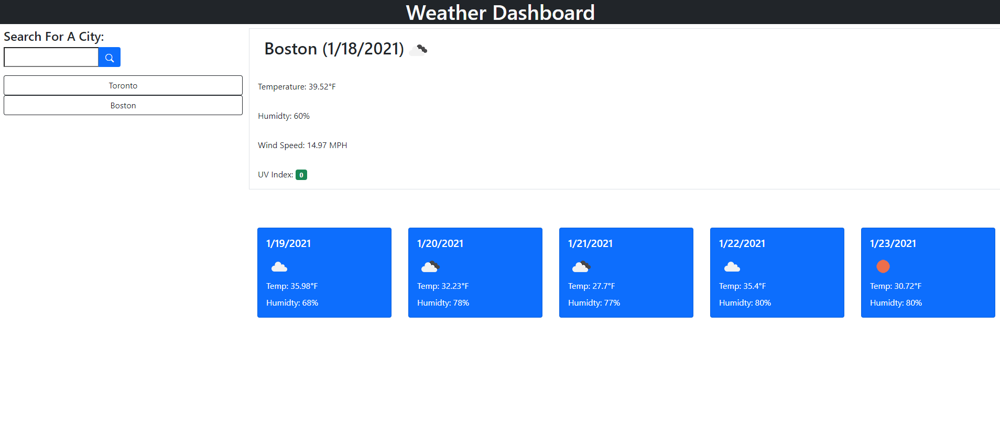

# Weather Dashboard

* [General Info](#General-Info)
* [Technologies](#Technologies)
* [Setup](#Setup)
* [Preview](#Preview)

##General Info
Simple Interface which allows you to search for weather in cities.
* Search will bring up current weather and 5-day forecast
* Searches are saved to local storage
* Previous searches display below the input form as buttons
* Previous searches can be clicked to display that cities weather

## Technologies
Site was created with:
* HTML
* Bootstrap CSS
* Javascript

## Setup
Site can be visited at https://krispywing.github.io/weather-dashboard

## Preview
